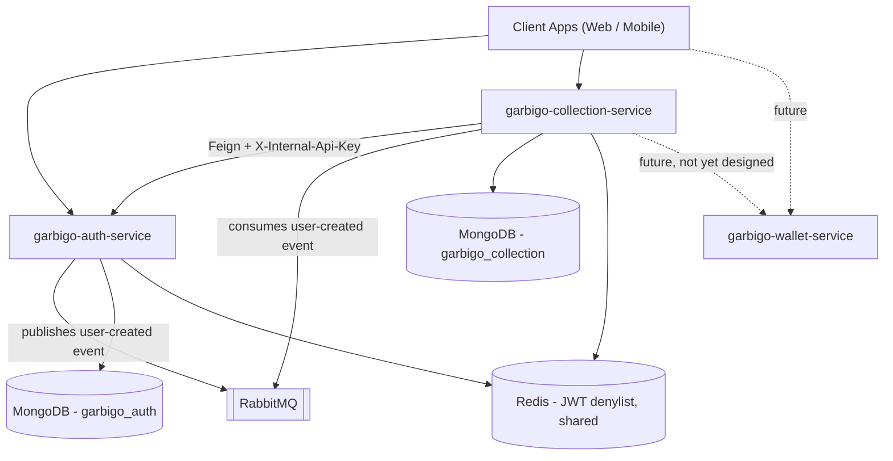

# Garbigo Collection Service

**Status:** Planning — not yet implemented. This document is the blueprint for the build.

The second of three Garbigo microservices. Where `garbigo-auth-service` owns *who a user is*, this service owns *the actual garbage collection business* — pickup requests, scheduling, collector assignment, and complaint handling. Payments are explicitly out of scope here and deferred to a future `garbigo-wallet-service`, which is not designed yet.

<br/>

## Menu

- [System Context](#system-context)
- [Scope](#scope)
- [Domain Model](#domain-model)
- [Naming Reference](#naming-reference)
- [Package Structure](#package-structure)
- [API Reference (Planned)](#api-reference-planned)
- [Integration with Auth Service](#integration-with-auth-service)
- [Tech Stack](#tech-stack)
- [Environment Variables (Planned)](#environment-variables-planned)
- [Roadmap](#roadmap)

<br/>

## System Context



Each service owns its own database (database-per-service). The one thing that's *shared*, deliberately, is the Redis instance holding the JWT revocation denylist — both services need to see the same revoked-token entries, or logout stops meaning anything consistently across the system.

<br/>

## Scope

**In scope:**
- Clients creating garbage collection pickup requests
- Assigning a collector to a request (manual by ops staff, or auto-matching later)
- Tracking a request's status through its lifecycle
- Recurring collection schedules (a structured upgrade from the free-text `collectionSchedule` field already sitting on `User` in auth-service)
- Complaints tied to a specific collection request
- Collectors viewing and updating their assigned jobs

**Explicitly out of scope:**
- Payments, wallets, transaction history — `garbigo-wallet-service`, not yet designed
- User identity, authentication, profiles, social features (follow/like/review), profile view tracking — all already owned by `garbigo-auth-service`
- Issuing JWTs — only auth-service does that; this service only *validates* them

<br/>

## Domain Model

| Entity | Purpose | Key Fields |
|---|---|---|
| `CollectionRequest` | A single pickup request/booking | `id`, `clientId`, `collectorId`, `wasteType`, `status`, `scheduledAt`, `address`, `latitude`, `longitude`, `notes`, `quotedPrice`, `createdAt`, `updatedAt` |
| `RecurringSchedule` | A client's standing collection arrangement | `id`, `clientId`, `frequency`, `dayOfWeek`, `wasteTypes`, `active` |
| `Complaint` | An issue reported against a specific request | `id`, `collectionRequestId`, `reporterId`, `description`, `status`, `createdAt` |
| `UserSummary` | Local, read-only mirror of auth-service users | `id`, `email`, `displayUsername`, `role`, `active` |

**Enums:**
- `WasteType`: `GENERAL`, `ORGANIC`, `RECYCLABLE`, `HAZARDOUS`, `ELECTRONIC`, `BULK`
- `CollectionStatus`: `PENDING`, `ASSIGNED`, `IN_PROGRESS`, `COMPLETED`, `CANCELLED`, `DISPUTED`
- `ScheduleFrequency`: `DAILY`, `WEEKLY`, `BIWEEKLY`, `MONTHLY`
- `ComplaintStatus`: `OPEN`, `IN_REVIEW`, `RESOLVED`

`UserSummary` is not this service's source of truth for identity — it's a cache, kept current by consuming auth-service's `user-created` event (and, eventually, whatever event auth-service publishes on role/status changes, which doesn't exist yet and would need adding there first).

<br/>

## Naming Reference

Decided now, for consistency once implementation starts.

| Item | Name |
|---|---|
| Repository | `garbigo_collection-service` |
| Base package | `com.garbigo.collection` |
| Main class | `GarbigoCollectionServiceApplication` |
| MongoDB database | `garbigo_collection` |
| Default port | `8081` (auth-service is `8080`; `8082` reserved for wallet-service) |
| RabbitMQ consumer queue | `user-created-queue` (already exists, published by auth-service — this service becomes a second consumer of it) |

<br/>

## Package Structure

```
src/main/java/com/garbigo/collection
├── client         # Feign clients - AuthServiceClient calls back into auth-service
├── config          # Security, Mongo, Redis, RabbitMQ, Feign
├── controller       # CollectionRequestController, ScheduleController, ComplaintController
├── dto              # Request/response payloads
├── exception        # CustomException + global JSON error handling (same pattern as auth-service)
├── messaging        # UserCreatedEventListener (RabbitMQ consumer)
├── model            # CollectionRequest, RecurringSchedule, Complaint, UserSummary, enums
├── repository       # Spring Data MongoDB repositories
├── security         # JwtFilter, JwtUtil (validation only - no token issuance here)
└── service          # CollectionRequestService, SchedulingService, ComplaintService, UserSummaryService
```

Deliberately mirrors auth-service's structure (`config`/`controller`/`dto`/`exception`/`model`/`repository`/`security`/`service`) so anyone who's worked on one can navigate the other immediately. `client` and `messaging` are the two additions — auth-service is the first service in the system, so it never needed to call out to anyone or consume anyone else's events.

<br/>

## API Reference (Planned)

| Method | Endpoint | Access | Description |
|---|---|---|---|
| POST | `/collections` | Auth (CLIENT) | Create a pickup request |
| GET | `/collections/{id}` | Auth | Get a single request |
| GET | `/collections/mine` | Auth (CLIENT) | The current client's own requests |
| GET | `/collections/assigned` | Auth (COLLECTOR) | The current collector's assigned jobs |
| PUT | `/collections/{id}/assign` | Auth (ADMIN/OPERATIONS) | Assign a collector to a request |
| PUT | `/collections/{id}/status` | Auth (COLLECTOR) | Update job status |
| DELETE | `/collections/{id}` | Auth (CLIENT) | Cancel a request |
| POST | `/schedules` | Auth (CLIENT) | Create a recurring schedule |
| GET | `/schedules/mine` | Auth (CLIENT) | The current client's schedules |
| PUT / DELETE | `/schedules/{id}` | Auth (CLIENT) | Update / remove a schedule |
| POST | `/complaints` | Auth | File a complaint against a request |
| GET | `/complaints/mine` | Auth | The current user's filed complaints |
| PUT | `/complaints/{id}/resolve` | Auth (ADMIN/SUPPORT) | Resolve a complaint |

Exact request/response shapes aren't fixed yet — this is the endpoint inventory to build against, not a finished contract.

<br/>

## Integration with Auth Service

**Validating end-user requests.** This service runs its own `JwtFilter`/`JwtUtil`, structurally identical to auth-service's, but *validation-only* — it never generates a token. It needs the identical `JWT_SECRET` value auth-service uses, or every signature check fails.

**Checking revocation.** Same reasoning: it needs the same Redis instance auth-service writes `revoked:jti:*` entries to, so a token revoked via auth-service's `/auth/logout` is correctly rejected here too, not just there.

**Calling auth-service directly (Feign).** For anything not covered by the local `UserSummary` cache — say, fetching a user's full profile to display alongside a collection request — this service calls auth-service via Feign, presenting the shared `INTERNAL_API_KEY` in the `X-Internal-Api-Key` header. Auth-service's `InternalApiKeyFilter` already exists and accepts this; nothing changes on that side.

**Building the local user cache.** A `UserCreatedEventListener` consumes auth-service's existing `user-created-queue`, upserting into `UserSummary` on each message. This is what lets `/collections/assigned` know a caller's role is `COLLECTOR` without a network round-trip per request. Note: auth-service currently only publishes on *creation* — if a user's role or active status changes later, this service won't hear about it until that gap is closed on the auth-service side (a new event type, or this service falling back to a Feign call when it needs certainty).

<br/>

## Tech Stack

Matches auth-service, for consistency across the system: Java 21, Spring Boot 4.1.1, Spring Security 7.1.1, MongoDB, Redis (shared instance for the JWT denylist), RabbitMQ, Maven, Jakarta Bean Validation, OpenFeign (new to this service).

<br/>

## Environment Variables (Planned)

| Variable | Purpose |
|---|---|
| `MONGODB_URI` | This service's own MongoDB (`garbigo_collection`, not `garbigo_auth`) |
| `REDIS_HOST`, `REDIS_PORT` | Must point at the same Redis auth-service uses |
| `RABBITMQ_HOST`, `RABBITMQ_PORT`, `RABBITMQ_USERNAME`, `RABBITMQ_PASSWORD` | Same broker as auth-service |
| `JWT_SECRET` | Must be the identical value configured in auth-service |
| `INTERNAL_API_KEY` | Must be the identical value configured in auth-service |
| `AUTH_SERVICE_URL` | Base URL for Feign calls into auth-service (e.g. `http://localhost:8080`) |
| `SERVER_PORT` | `8081` |

<br/>

## Roadmap

1. Scaffold the project (package structure above, security/config classes ported from auth-service's patterns)
2. `CollectionRequest` CRUD + status lifecycle
3. `UserCreatedEventListener` + `UserSummary` cache
4. Collector assignment
5. `RecurringSchedule`
6. `Complaint`
7. Design `garbigo-wallet-service` and its integration point into this service (payment confirmation before finalizing a request, most likely)
